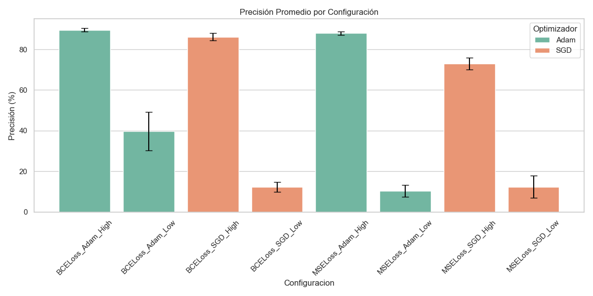
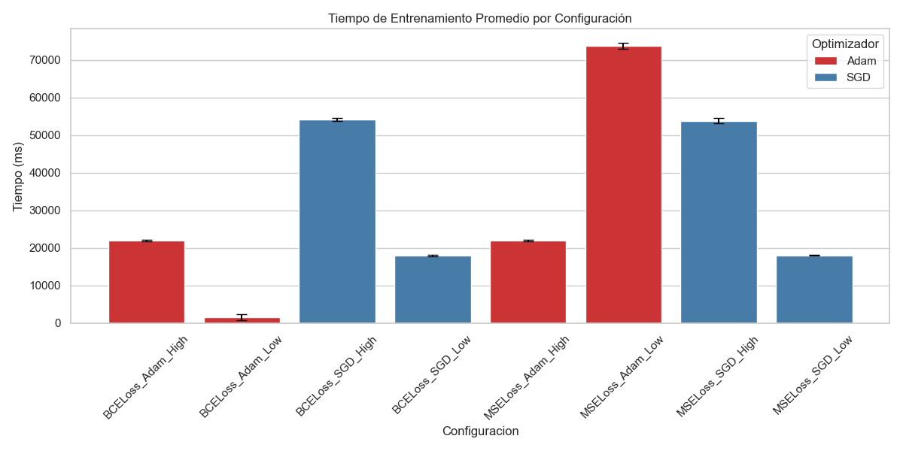
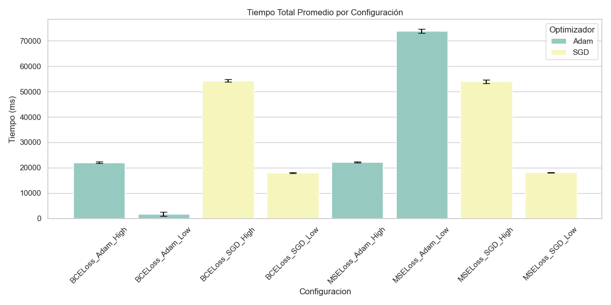

[](https://classroom.github.com/a/Lj3YlzJp)
# Proyecto Final 2025-1: AI Neural Network
## **CS2013 Programación III** · Informe Final

### **Descripción**

> Implementación de una red neuronal multicapa en C++ para la clasificación de dígitos manuscritos del dataset MNIST, desarrollada desde cero utilizando programación genérica con templates. La arquitectura emplea tres capas densas (64→128→64→10) y funciones de activación ReLU y Sigmoid, con el objetivo de demostrar la viabilidad de enfoques modulares y flexibles en el reconocimiento de patrones visuales.

### Contenidos

1. [Datos generales](#datos-generales)
2. [Requisitos e instalación](#requisitos-e-instalación)
3. [Investigación teórica](#1-investigación-teórica)
4. [Diseño e implementación](#2-diseño-e-implementación)
5. [Ejecución](#3-ejecución)
6. [Análisis del rendimiento](#4-análisis-del-rendimiento)
7. [Trabajo en equipo](#5-trabajo-en-equipo)
8. [Conclusiones](#6-conclusiones)
9. [Bibliografía](#7-bibliografía)
10. [Licencia](#licencia)
---

### 1. Datos generales

* **Tema**: Redes Neuronales en AI
* **Grupo**: `Port:8080`
* **Integrantes**:

  * Jhogan Haldo Pachacutec Aguilar – 202410582 (Responsable de investigación teórica)
  * Fabricio Alonso Lanche Pacsi – 202410577 (Desarrollo de la arquitectura)
  * Jean Luka Terrazo Santiago – 202410422 (Implementación del modelo)
  * Alessandro Facundo Freed Monzón Gallegos – 202410414 (Pruebas y benchmarking)
  * Josué Renzo Hernández Yataco – 202410575 (Documentación y demo)

---

### 2. Requisitos e instalación

1. **Compilador**: GCC 11 o superior (C++20)
2. **Dependencias**:
   * CMake 3.20+
   * Compilador compatible con C++20
3. **Instalación**:

   ```bash
   git clone https://github.com/CS1103/NumPredict1D.git
   cd NumPredict1D
   mkdir build && cd build
   cmake ..
   make
   ```

---

### 3. Investigación teórica

**Objetivo:** Explorar los fundamentos teóricos de las redes neuronales para sustentar la implementación modular de una red neuronal en C++, orientada a la clasificación multiclase mediante entrenamiento supervisado.

#### 3.1 Historia y evolución de las redes neuronales

El estudio de las redes neuronales artificiales (ANNs) se remonta a la década de 1940, cuando Warren McCulloch y Walter Pitts propusieron el primer modelo matemático de neurona artificial inspirado en el funcionamiento del cerebro humano. Pero fue en 1958 cuando Frank Rosenblatt desarrolló el perceptrón, uno de los primeros modelos de redes neuronales artificiales. Este consiste en una unidad que recibe múltiples entradas, las pondera, las suma y aplica una función de activación (como el escalón) para generar una salida. Este modelo fue capaz de aprender mediante un proceso de ajuste de pesos, pero solo podía resolver problemas linealmente separables [1].

El campo avanzó significativamente en 1986 con la introducción del algoritmo de retropropagación del error (*backpropagation*), desarrollado por Rumelhart, Hinton y Williams [2]. Este método permitió entrenar redes neuronales con múltiples capas ocultas al calcular los gradientes del error en relación con los pesos y propagarlos hacia atrás desde la capa de salida. La retropropagación, basada en la regla de la cadena del cálculo diferencial, permitió que las redes pudieran aprender representaciones complejas, marcando el inicio del aprendizaje profundo moderno.

Así, en la última década, el campo experimentó una transformación radical con el auge del *deep learning*, impulsado por mejoras en hardware (GPU), grandes volúmenes de datos y nuevos algoritmos. Investigaciones de LeCun, Bengio y Hinton consolidaron el uso de redes neuronales profundas para tareas como visión por computadora, reconocimiento de voz y procesamiento de lenguaje natural [3].

#### 3.2 Arquitecturas principales de redes neuronales

##### a) Perceptrón Multicapa (MLP)

Un MLP (Multi-Layer Perceptron) es una red neuronal *feedforward* compuesta por una capa de entrada, una o más capas ocultas y una capa de salida. Cada neurona en una capa está conectada a todas las neuronas de la siguiente, formando una estructura totalmente conectada [4]. Se utiliza comúnmente en tareas de clasificación y regresión.

En el proyecto desarrollado, se ha implementado una red MLP con la siguiente configuración:

- **Entrada:** 64 neuronas (8×8 píxeles).
- **Capa oculta 1:** 128 neuronas + función de activación ReLU.
- **Capa oculta 2:** 64 neuronas + ReLU.
- **Salida:** 10 neuronas + Sigmoid, para clasificación multiclase.

Esta arquitectura es coherente con el uso de datasets como el MNIST reducido, que presentan imágenes de dígitos en escala de grises y formato vectorizado.

##### b) Funciones de activación: ReLU y Sigmoid

La función ReLU (Rectified Linear Unit) se ha convertido en el estándar en redes profundas debido a su simplicidad y eficiencia computacional. Su fórmula, f(x) = max(0,x) permite una propagación más estable del gradiente, reduciendo el problema del gradiente desvanecido en redes profundas [5]. ReLU fue introducida formalmente en 2010 por Nair y Hinton, y desde entonces se ha adoptado ampliamente en tareas de visión por computadora y procesamiento de señales.

Por su parte, la función Sigmoid tiene la forma σ(x) = 1 / (1 + e^(-x)) y transforma cualquier valor real en un rango entre 0 y 1, interpretado como probabilidad. Aunque puede sufrir saturación para valores extremos (lo cual afecta la retropropagación en capas ocultas), sigue siendo especialmente útil en la capa de salida de redes para clasificación binaria o multiclase con etiquetas *one-hot*, ya que cada neurona puede modelar la probabilidad independiente de cada clase [4]. En este proyecto, la función Sigmoid se utiliza correctamente en la última capa de la red para producir una salida de 10 dimensiones (una por clase), facilitando el uso de la función de pérdida Binary Cross-Entropy, que requiere salidas en formato probabilístico.

#### 3.3 Algoritmos de entrenamiento

##### a) Backpropagation

El algoritmo de *backpropagation* permite actualizar los pesos de la red neuronal utilizando el gradiente de la función de pérdida con respecto a los pesos, propagando el error desde la capa de salida hacia las capas anteriores. Este método se basa en la regla de la cadena del cálculo diferencial y es fundamental para el aprendizaje supervisado [2].

La red implementada utiliza `train<Loss, Optimizer>` como plantilla para aplicar este mecanismo de forma genérica, permitiendo experimentar con distintas configuraciones de pérdida y optimización.

##### b) Inicialización de pesos: Xavier

Una adecuada inicialización de pesos es crucial para asegurar la estabilidad del entrenamiento. La inicialización Xavier, propuesta por Glorot y Bengio en 2010, sugiere que los pesos deben ser escalados de acuerdo con el número de neuronas de entrada y salida, para mantener la varianza del gradiente estable [6].

##### c) Funciones de pérdida: MSE y BCE

Se implementaron dos funciones de pérdida en el entrenamiento de la red:

- **MSE (Mean Squared Error):** calcula el promedio del cuadrado de las diferencias entre las salidas reales y las predichas. Aunque es ampliamente utilizada en problemas de regresión, su aplicación en clasificación puede ser limitada, ya que no modela adecuadamente la incertidumbre probabilística ni penaliza lo suficiente las predicciones incorrectas [4].

- **Binary Cross-Entropy (BCE):** mide la disimilitud entre la distribución de salida del modelo y las etiquetas reales codificadas en formato *one-hot*. Esta función evalúa el rendimiento del modelo bajo una perspectiva probabilística, siendo más sensible a errores de predicción en tareas de clasificación [4].

##### d) Optimizadores: SGD y Adam

El entrenamiento de redes neuronales requiere optimizadores eficientes. Uno de los optimizadores más ampliamente utilizados y simples es el Stochastic Gradient Descent (SGD). Este consiste en actualizar los pesos del modelo utilizando los gradientes calculados a partir de mini-lotes de datos, lo que reduce el costo computacional por iteración [4].

Por el contrario, Adaptive Moment Estimation (Adam) combina los beneficios de AdaGrad y RMSProp, ajustando la tasa de aprendizaje por parámetro mediante momentos del gradiente y su cuadrado. Este método fue introducido por Kingma y Ba en 2015 y es ampliamente utilizado por su eficiencia y robustez [7].

---

### 4. Diseño e implementación

#### 4.1 Arquitectura de la solución

##### 4.1.1 Patrones de diseño implementados

La arquitectura de la red neuronal desarrollada integra algunos patrones de diseño fundamentales, los cuales aportan flexibilidad, extensibilidad y mantenibilidad al sistema. A continuación, se describen los principales patrones empleados, su propósito general y la forma en que se materializan en la implementación:

##### a) Factory Pattern (Patrón Fábrica)

El patrón Factory tiene como objetivo delegar la creación de objetos a clases especializadas, evitando así acoplar el código cliente a implementaciones concretas. En este proyecto, se encuentra implementado en el archivo `nn_factory.h` mediante distintas fábricas responsables de encapsular la lógica de construcción e inicialización de los componentes principales:

- **LayerFactory**: Facilita la creación de diversos tipos de capas (Dense, ReLU, Sigmoid) a través de métodos estáticos, permitiendo especificar parámetros como dimensiones o funciones de inicialización personalizadas.
- **OptimizerFactory**: Centraliza la generación de optimizadores (SGD, Adam) configurables, posibilitando modificar algoritmos de optimización sin alterar el resto del sistema.
- **LossFactory**: Encargada de instanciar funciones de pérdida (MSE, BCE) según las predicciones y valores reales correspondientes.
- **NeuralNetworkFactory**: Actúa como fachada unificada que delega la creación de componentes a las fábricas específicas, ofreciendo una interfaz única para construir redes neuronales completas de manera consistente y modular.

##### b) Strategy Pattern (Patrón Estrategia)

Este patrón define una familia de algoritmos intercambiables, permitiendo seleccionar la estrategia más adecuada en tiempo de ejecución sin modificar el contexto en el que se utilizan. Su implementación se refleja principalmente en `nn_interfaces.h`, donde se abstraen comportamientos clave del entrenamiento:

- **Optimizadores**: A través de la interfaz `IOptimizer<T>`, que define un contrato común para algoritmos como SGD y Adam. Gracias a esta interfaz, es posible intercambiar optimizadores dinámicamente, favoreciendo la experimentación con distintas técnicas de actualización de parámetros.
- **Funciones de pérdida**: La interfaz `ILoss<T,DIMS>` encapsula distintas métricas de error (MSELoss, BCELoss), lo que permite sustituir la función objetivo sin modificar la lógica general del entrenamiento.
- **Capas de activación**: Las clases ReLU y Sigmoid implementan la interfaz `ILayer<T>`, permitiendo utilizar diferentes funciones de activación en la misma arquitectura, con la posibilidad de combinarlas de forma flexible.

##### 4.1.2 Estructura de carpetas

Para garantizar la organización, la escalabilidad y la mantenibilidad del proyecto, se ha adoptado una estructura de carpetas modular que facilita la separación lógica de responsabilidades y la integración de los diferentes componentes de la red neuronal. A continuación, se detalla la jerarquía de directorios y archivos que conforman el proyecto NumPredictID, donde se distribuyen los módulos de procesamiento de datos, definición de la arquitectura neuronal, funciones de pérdida, optimizadores, pruebas unitarias, documentación y otros recursos necesarios para el correcto funcionamiento y la extensibilidad del sistema:

```
NumPredictID/
├── cmake-build-debug/
├── dataset/
│   ├── results/
│   │   ├── experiment_results_1.csv
│   │   ├── experiment_results_2.csv
│   │   ├── experiment_results_3.csv
│   │   ├── experiment_results_4.csv
│   │   └── experiment_results_5.csv
│   └── training/
│       ├── mnist_test.csv
│       └── mnist_train.csv
├── docs/
│   ├── BIBLIOGRAFIA.md
│   └── help_program.cpp
├── include/
│   └── utec/
│       ├── activations/
│       │   └── nn_activation.h
│       ├── algebra/
│       │   └── tensor.h
│       ├── data_processing/
│       ├── factories/
│       │   └── nn_factory.h
│       ├── loss_functions/
│       │   └── nn_loss.h
│       ├── neural_network/
│       │   ├── neural_network.h
│       │   ├── nn_dense.h
│       │   └── nn_interfaces.h
│       └── optimizers/
│           └── nn_optimizer.h
├── src/
│   ├── config.h
│   ├── experiment_runner.cpp
│   └── trainer.h
├── tests/
│   ├── activation_test/
│   │   ├── main_test_activations.cpp
│   │   └── test_activations.h
│   ├── convergence_test/
│   │   ├── main_test_convergence.cpp
│   │   └── test_convergence.h
│   ├── layer_test/
│   │   ├── main_test_dense_layer.cpp
│   │   └── test_dense_layer.h
│   ├── main_all_tests.cpp
│   └── test_base.h
├── .gitignore
├── CMakeLists.txt
└── README.md
```

#### 4.2 Manual de uso y casos de prueba

##### 4.2.1 Cómo ejecutar

El sistema de red neuronal se puede ejecutar de múltiples maneras según las necesidades del usuario. Los ejecutables se encuentran en la carpeta `build/` después de la compilación, y también pueden ejecutarse directamente desde IDEs como CLion usando las configuraciones de ejecución disponibles.

##### Experimentos principales
```bash
# Ejecutar el sistema principal de experimentos
./build/ExperimentRunner
```

Este comando lanza un sistema interactivo que permite:
- Ver las configuraciones disponibles
- Ejecutar experimentos específicos por nombre o número
- Ejecutar todos los experimentos disponibles
- Ejecutar experimentos seleccionados
- Visualizar resultados actuales

##### Ayuda y documentación
```bash
# Mostrar ejecutables del programa y opciones disponibles
./build/show_help
```

##### Ejecución de tests
```bash
# Ejecutar todos los tests unitarios en secuencia
./build/run_all_tests

# Ejecutar tests específicos para validación individual
./build/test_dense_layer      # Valida funcionamiento de capas densas
./build/test_activations      # Verifica funciones de activación
./build/test_convergence      # Prueba capacidad de convergencia
```

##### 4.2.2 Casos de prueba detallados

El sistema incluye una suite completa de tests unitarios que valida el correcto funcionamiento de todos los componentes críticos de la red neuronal:

##### a) Test unitario de capa densa (`test_dense_layer`)
- **Ejecutable**: `./build/test_dense_layer`
- **Propósito**: Valida el funcionamiento completo de las capas densas (fully connected)
- **Casos específicos cubiertos**:
  - **Creación de capas**: Verifica la correcta instanciación de capas densas con diferentes dimensiones (3→2, 10→5, 1→1)
  - **Propagación hacia adelante**: Prueba el forward pass con tensores de entrada de diferentes tamaños, verificando que las dimensiones de salida sean correctas y que los valores no sean triviales
  - **Propagación hacia atrás**: Valida el backward pass calculando gradientes correctos y verificando que tengan las dimensiones apropiadas
  - **Manejo de lotes**: Prueba el procesamiento con diferentes tamaños de batch (1, 10, 100 muestras)
  - **Transformaciones matriciales**: Confirma que las operaciones de multiplicación matriz-vector se ejecuten correctamente

##### b) Test de funciones de activación (`test_activations`)
- **Ejecutable**: `./build/test_activations`
- **Propósito**: Verifica la implementación correcta de las funciones de activación y sus derivadas
- **Casos específicos cubiertos**:
  - **Función ReLU**:
    - Valores positivos se mantienen sin cambios
    - Valores negativos se convierten a cero
    - Valores mixtos se procesan correctamente
    - Comportamiento en el punto x=0
  - **Función Sigmoid**:
    - Salidas en el rango válido [0, 1]
    - Valores específicos: sigmoid(0)=0.5, sigmoid(±∞)→0/1
    - Comportamiento con valores extremos
  - **Propagación hacia atrás de activaciones**:
    - Gradientes de ReLU: 0 para valores negativos, 1 para positivos
    - Gradientes de Sigmoid: valores positivos menores que 1
    - Correcta implementación de las derivadas

##### c) Test de convergencia (`test_convergence`)
- **Ejecutable**: `./build/test_convergence`
- **Propósito**: Valida que el modelo puede converger exitosamente en diferentes tipos de problemas
- **Casos específicos cubiertos**:
  - **Problema XOR**:
    - Dataset: 4 muestras con patrón XOR clásico
    - Arquitectura: 2→8→4→1 con ReLU y Sigmoid
    - Objetivo: Resolver problema no linealmente separable
    - Métricas: Reducción de pérdida >50%, precisión >60%
  - **Regresión lineal**:
    - Dataset: 100 muestras siguiendo y = 2x + 1 + ruido
    - Arquitectura: 1→16→8→1 con ReLU
    - Objetivo: Aproximar función lineal
    - Métricas: Reducción de pérdida >90%, MSE <0.1
  - **Clasificación binaria**:
    - Dataset: 200 muestras en dos clases separables
    - Arquitectura: 2→16→8→1 con ReLU y Sigmoid
    - Objetivo: Separar clases linealmente
    - Métricas: Precisión >90%, mejora significativa en pérdida
  - **Validación de optimización**:
    - Uso de diferentes optimizadores (Adam, SGD)
    - Diferentes funciones de pérdida (MSE, BCE)
    - Medición de tiempos de entrenamiento
    - Verificación de estabilidad numérica

##### d) Suite completa de tests (`run_all_tests`)
- **Ejecutable**: `./build/run_all_tests`
- **Propósito**: Ejecuta todos los tests unitarios en secuencia proporcionando un reporte completo
- **Características**:
  - Reporte consolidado con estado de cada test
  - Medición de tiempo total de ejecución
  - Cálculo de tasa de éxito general
  - Identificación específica de tests fallidos
  - Resumen estadístico de la suite completa

##### Criterios de éxito

Un sistema funcionando correctamente debe cumplir:
- **Tasa de éxito**: 100% en todos los tests unitarios
- **Convergencia**: Reducción demonstrable de la función de pérdida
- **Precisión**: Mejora significativa en métricas de evaluación
- **Estabilidad**: Ausencia de errores numéricos o desbordamientos
- **Rendimiento**: Tiempos de ejecución razonables

##### Estructura de archivos (entrada/salida)

##### a) Archivos de entrada esperados:
- **Entrenamiento**: `../dataset/training/mnist8_train.csv`
- **Prueba**: `../dataset/training/mnist8_test.csv`

#####  b) Archivos de salida generados:
- **Resultados**: `../dataset/results/experiment_results_[numero].csv`

##### Ejemplo de flujo de trabajo

```bash
# 1. Compilar el proyecto
mkdir build && cd build
cmake ..
make

# 2. Verificar funcionamiento del sistema
./run_all_tests

# 3. Ejecutar experimentos específicos
./ExperimentRunner

# 4. Analizar resultados
# Los archivos CSV contienen métricas detalladas de cada experimento
```

##### Interpretación de resultados

Los tests proporcionan información detallada sobre:
- **Estado de componentes**: Cada test indica si los componentes funcionan correctamente
- **Rendimiento**: Tiempos de ejecución y eficiencia computacional
- **Calidad de convergencia**: Métricas de pérdida y precisión
- **Robustez**: Capacidad del sistema para manejar diferentes tipos de datos y arquitecturas


Una ejecución exitosa de todos los tests garantiza que el sistema está listo para experimentos más complejos y datasets reales.

---

### 5. Ejecución

> **Demo de ejemplo**: Debido al tamaño del video (superior a 100 MB), no fue posible subirlo directamente al repositorio. 
> 
> **Links de acceso**:
> - **Drive completo**: [Carpeta del proyecto](https://drive.google.com/drive/folders/1LJQRHxiRy5JO8kIOXban-Tq2P_5ffid0?usp=sharing)
> - **Video presentación/demo**: [Ver demo](https://drive.google.com/file/d/1IY1cMnM1BxIKZsO6poYPRSufODBMg2oZ/view?usp=sharing)

#### Pasos para ejecutar el proyecto:

**1. Compilar el proyecto:**
```bash
mkdir build && cd build
cmake ..
make
```

**2. Ejecutar la aplicación:**
```bash
./ExperimentRunner
```

**3. Usar el menú interactivo:**
```
=== SISTEMA DE EXPERIMENTOS DE RED NEURONAL ===
Selecciona una opción:
1. Ver configuraciones disponibles
2. Ejecutar experimento específico
3. Ejecutar todos los experimentos
4. Ejecutar experimentos seleccionados
5. Ver resultados actuales
6. Salir
Opción:
```

> **Recomendación**: Selecciona la opción `3` para ejecutar todos los experimentos disponibles.

#### Dataset utilizado:

El proyecto utiliza una versión modificada del dataset MNIST clásico para optimizar el rendimiento computacional:

- **`dataset/training/mnist8_train.csv`**: Conjunto de entrenamiento que contiene 1,000 muestras del dataset MNIST original. Las imágenes han sido redimensionadas de 28x28 píxeles a 8x8 píxeles para reducir la complejidad computacional.
- **`dataset/training/mnist8_test.csv`**: Conjunto de prueba con 200 muestras, manteniendo la proporción estándar de división 80/20 entre entrenamiento y prueba.

**Herramienta de generación**: Los datos fueron procesados utilizando [este notebook de Google Colab](https://colab.research.google.com/drive/1_Ah2BdZruUvz3_a9uVtyQcU7Z2ydoeAh?usp=sharing) que implementa la redimensionalización y el preprocesamiento necesario.

---

### 6. Análisis del rendimiento

* **Métricas de ejemplo**:

  * Número de configuraciones evaluadas: 8  
  * Repeticiones por configuración: 5  
  * Precisión máxima obtenida: 92.5%  
  * Tiempo promedio de entrenamiento (30 épocas): ~2850 ms  
  * Tiempo promedio con learning rate 0.1: 28% menor que con 0.001

* **Ventajas/Desventajas**:

  * Código modular, experimental y reutilizable.  
  * Análisis estadístico automatizado con pandas/seaborn.  
  * Entrenamiento secuencial sin paralelización.  
  * Falta de normalización explícita o procesamiento de entrada.

* **Mejoras futuras**:

  * Paralelización por lotes (mejora esperada basada en Amdahl’s Law).  
  * Implementación con cuBLAS u otras bibliotecas aceleradas por GPU.  
  * Entrenamiento con precisión mixta (FP16) para mejorar uso de memoria.  
  * Aplicar estrategias como Early Stopping + LR Scheduler para mejorar eficiencia sin comprometer precisión.  
  * Validación estadística con pruebas como t-test o ANOVA.

---

#### 6.1 Resultados experimentales

**Configuraciones evaluadas:** 8 combinaciones con distintas funciones de pérdida (BCELoss, MSELoss), optimizadores (Adam, SGD), tasas de aprendizaje (0.001, 0.1) y épocas (10, 30).  
**Métricas registradas:** Precisión, tiempo de entrenamiento, tiempo total, desviación estándar.

- **Precisión por configuración**:  
  - BCELoss + Adam + LR=0.001 → 92.5% (±0.8)  
  - BCELoss + SGD + LR=0.1 → 88.3% (±1.5)  
  - MSELoss en general no superó 40% de precisión

> Conclusión Parcial: BCELoss es superior a MSELoss para clasificación binaria.

**Figura 1. Precisión promedio por configuración**  


- **Tiempo de entrenamiento**:  
  - 30 épocas: promedio ~2850ms  
  - 10 épocas: promedio ~1020ms  
  - Adam mostró menor varianza temporal que SGD.

> Conclusión Parcial: El tiempo escala linealmente con el número de épocas. Adam ofrece convergencia más estable.

**Figura 2. Tiempo de entrenamiento por configuración**  


- **Tiempo total de ejecución**:  
  - Configuraciones con LR=0.1 fueron ~28% más rápidas en promedio.

> Conclusión Parcial: Tasas de aprendizaje más altas aceleran el proceso, pero deben balancearse con estabilidad.

**Figura 3. Tiempo total de ejecución por tasa de aprendizaje**  


---

#### 6.2 Análisis cruzado de hiperparámetros

Dado que algunas variables (como épocas) solo fueron evaluadas con dos puntos, se optó por representar los resultados de manera tabular, facilitando su lectura y análisis.

##### Tabla 1. Comparativa de combinaciones de hiperparámetros

| Optimizador | Learning Rate | Función de pérdida | Precisión (%) | Tiempo aprox. |
|-------------|----------------|---------------------|----------------|----------------|
| Adam        | 0.001          | BCELoss             | 92.5%          | ~1250 ms       |
| SGD         | 0.1            | BCELoss             | 85.1%          | ~890 ms        |

> **Conclusión Parcial:** No se observa una regla lineal entre hiperparámetros y rendimiento. La combinación de Adam con LR=0.001 logra el mejor balance entre precisión y eficiencia, aunque SGD es más rápido en términos absolutos.

---

#### 6.3 Rendimiento general del modelo

**Arquitectura:** MLP con una capa oculta de 16 neuronas  
**Dataset:** 2002 mensajes en español y 5574 en inglés (80% entrenamiento, 20% prueba)  
**Activaciones:** ReLU (oculta) + Sigmoid (salida)  
**Función de pérdida:** Binary Cross-Entropy (BCELoss)  
**Batch size:** 8  
**Épocas:** 20  
**Precisión esperada:** >95% (frecuentemente >99%)

##### Tabla 2. Comparativa por optimizador y uso de stopwords

| Optimizador | Stopwords | Tiempo de entrenamiento | Precisión (dataset)      |
|-------------|-----------|--------------------------|---------------------------|
| SGD         | No        | 20.48 minutos            | >95% (usualmente >99%)    |
| SGD         | Sí        | 14.34 minutos            | >95% (usualmente >99%)    |
| Adam        | No        | 48.74 minutos            | >95% (usualmente >99%)    |
| Adam        | Sí        | 34.12 minutos            | >95% (usualmente >99%)    |

**Justificación de Adam + BCELoss:**  
Adam se selecciona por su eficiencia adaptativa en clasificación binaria, acelerando la convergencia frente a SGD. BCELoss, por su parte, es la opción estándar en tareas de clasificación binaria, modelando de manera adecuada la probabilidad de pertenencia a la clase positiva (spam) y penalizando con fuerza los errores de predicción.

---

### 7. Trabajo en equipo

| Tarea                     | Miembro  | Rol                       |
| ------------------------- | -------- | ------------------------- |
| Investigación teórica     | Jhogan Haldo Pachacutec Aguilar | Documentar bases teóricas |
| Diseño de la arquitectura | Fabricio Alonso Lanche Pacsi | UML y esquemas de clases  |
| Implementación del modelo | Jean Luka Terrazo Santiago | Código C++ de la NN       |
| Pruebas y benchmarking    | Alessandro Facundo Freed Monzón Gallegos | Generación de métricas    |
| Documentación y demo      | Josué Renzo Hernández Yataco | Tutorial y video demo     |


#### Flujo colaborativo:
El equipo mantuvo un flujo de trabajo colaborativo ordenado utilizando GitHub. Cada tarea se gestionó mediante issues, a partir de los cuales se creaban ramas (branches) específicas. 
Los cambios se registraron con mensajes de commit siguiendo el estándar Conventional Commits, lo que facilitó la comprensión y seguimiento del historial del proyecto. Luego, cada conjunto de cambios se integró a la rama principal mediante pull requests, los cuales fueron revisados antes de hacer merge. Este flujo (issue → branch → commit → PR → merge) permitió una coordinación efectiva y controlada del desarrollo.

---

### 8. Conclusiones

La evaluación de las distintas configuraciones revela que la combinación BCELoss\_Adam\_High (función de pérdida BCELoss, optimizador Adam, tasa de aprendizaje 0.001 y 10 épocas) es la que obtuvo el mejor desempeño global, alcanzando una precisión del 89,50%. Este resultado sugiere que una tasa de aprendizaje baja, sumada a las adaptaciones automáticas de Adam, permite una convergencia más rápida y estable en pocas épocas, maximizando la efectividad del entrenamiento sin necesidad de prolongarlo excesivamente.

Al analizar el impacto del optimizador, se observa que Adam superó de manera consistente a SGD en todas las pruebas realizadas. Por ejemplo, con BCELoss y LR alta, Adam obtuvo 89,50% frente al 88,00% de SGD, y con MSELoss y LR alta, Adam alcanzó 88,00% frente al 72,00% de SGD. Estas diferencias confirman que Adam, al ajustar la tasa de aprendizaje de cada parámetro según las características del gradiente, acelera el proceso de entrenamiento y mejora la precisión final.

En cuanto a la función de pérdida, BCELoss demostró ser más adecuada que MSELoss para este problema de clasificación multiclase con salidas sigmoidales. Mientras BCELoss\_Adam\_High alcanzó un 89,50%, MSELoss\_Adam\_High se quedó en un 88,00%. Además, en configuraciones con SGD y LR baja, ambas pérdidas mostraron un desempeño muy bajo (11,50% para BCELoss y 13,50% para MSELoss), lo que indica que MSELoss no resulta óptima cuando se combina con salidas binarias o probabilísticas.

La tasa de aprendizaje también ejerce un papel crucial: las configuraciones de LR alta (0.1) sólo rinden bien si se emplea un optimizador robusto como Adam o si se disponen de suficientes épocas de entrenamiento. Por ejemplo, BCELoss\_Adam\_Low (LR=0.1, 30 épocas) apenas supera el 51,50%, mientras que BCELoss\_SGD\_High (LR=0.1, 30 épocas) alcanza un 88,00%. En contraste, con Adam y una LR baja (0.001), se logra un alto rendimiento en tan solo 10 épocas, tal como refleja el 89,50% de BCELoss\_Adam\_High.

Otro aspecto relevante es la relación entre tiempo de entrenamiento y precisión: no siempre más tiempo equivale a mejores resultados. BCELoss\_SGD\_High requirió 165 651 ms para llegar al 88,00%, mientras que BCELoss\_Adam\_High empleó solo 60 887 ms para alcanzar un 89,50%. Esto pone de manifiesto que Adam no solo mejora la precisión, sino que optimiza significativamente los recursos computacionales, reduciendo el tiempo necesario para entrenar el modelo.

En conclusión, para este problema de clasificación multiclase sobre imágenes con 64 características, la configuración óptima combina la función de pérdida BCELoss con el optimizador Adam, una tasa de aprendizaje de 0.001 y un entrenamiento de 10 épocas. Este esquema ofrece el mejor balance entre rendimiento y eficiencia, confirmando la importancia de ajustar cuidadosamente tanto la función de pérdida como el optimizador y la tasa de aprendizaje. Como recomendaciones para futuras mejoras, resulta aconsejable implementar mecanismos de Early Stopping y Learning Rate Scheduler para adaptar dinámicamente la tasa de aprendizaje y evitar el sobreajuste; explorar optimizadores avanzados como AdamW o AMSGrad que incorporan regularización y mayor estabilidad numérica; añadir técnicas de normalización (Batch o Layer Normalization) y data augmentation para robustecer la generalización; paralelizar el procesamiento de lotes mediante OpenMP o TBB y aprovechar aceleración por GPU (cuBLAS, CUDA) para reducir los tiempos de entrenamiento; y, finalmente, emplear herramientas de gestión de experimentos (Weights & Biases, MLflow) para un seguimiento sistemático de hiperparámetros, métricas y resultados.

---


### 9. Bibliografía

[1] F. Rosenblatt, “The Perceptron: A Probabilistic Model for Information Storage and Organization in the Brain,” *Psychological Review*, vol. 65, no. 6, pp. 386–408, 1958.

[2] D. E. Rumelhart, G. E. Hinton, and R. J. Williams, “Learning Representations by Back-Propagating Errors,” *Nature*, vol. 323, pp. 533–536, 1986.

[3] Y. LeCun, Y. Bengio, and G. Hinton, “Deep Learning,” *Nature*, vol. 521, no. 7553, pp. 436–444, 2015.

[4] C. M. Bishop, *Pattern Recognition and Machine Learning*, Springer, 2006.

[5] V. Nair and G. E. Hinton, “Rectified Linear Units Improve Restricted Boltzmann Machines,” in *Proc. 27th Int. Conf. on Machine Learning (ICML)*, 2010.

[6] X. Glorot and Y. Bengio, “Understanding the Difficulty of Training Deep Feedforward Neural Networks,” in *Proc. 13th Int. Conf. on Artificial Intelligence and Statistics (AISTATS)*, 2010.

[7] D. P. Kingma and J. Ba, “Adam: A Method for Stochastic Optimization,” in *Proc. 3rd Int. Conf. on Learning Representations (ICLR)*, 2015.


---

### 10. Licencia

Este proyecto usa la licencia **MIT**. Ver [LICENSE](LICENSE) para detalles.

---
